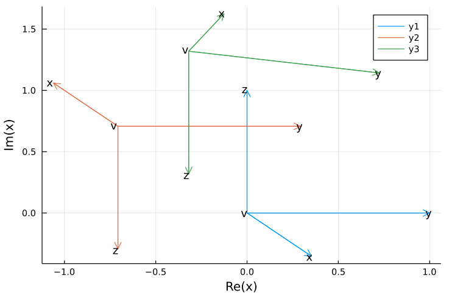

# DmdgpRealization

This is mainly used to construct the realized points and visualize the rotations in the coordinate system when applying the realization operations.  

## Basic Usage

For visualize a point with your own coordinate system, use the `sysGenerate()` function passing its cumulative torsion matrix C as parameter\*. Optionally, to scale the result, you can change the parameter scalar α, which is equal to 1 by default. 

> \* The matrix C is as defined in *A branch‐and‐prune algorithm for the molecular distance geometry problem* -- by Liberti, L., Lavor, C. and Maculan, N. (2008).

For example, 

```julia
C = B1*B2*B3*Bi(ω(230), θ(120))
sysGenerate(C)
```
that results in: 

```shell
5×4 Array{Any,2}:
   "x/|x|"    "y/|y|"    "z/|z|"    "i"
 -5.75462   -4.55695   -4.52137   -5.01377
  0.970454   0.272622   1.66232    1.07549
  1.99024    1.70985    1.96962    1.32683
  1.0        1.0        1.0        1.0
```
Where the secound, third and fourth lines refer, respectively, to the positions x, y and z of the elements named by the first line. The fifth line is about the homogeneous model.

### Flat Projection

You also can use the `flatProjection()` function to help the creating of flat figures with the points. Just pass the cumulative matrix C as a parameter and you will receive a matrix (with one line missing) representing the flat projections of the vectors of each column through the isometric perspective. Optionally, you can also change the perspective by passing the parameter x̂ as the two-dimensional vector that defines the direction of the third axis in the plane.

For example,

```julia
C = B1 # Origin
projection = flatProjection(C)
sysGenerate(projection)
```
that results in

```shell
3×4 Array{Any,2}:
   "x/|x|"   "y/|y|"   "z/|z|"   "i"
  0.353553  1.0       0.0       0.0
 -0.353553  0.0       1.0       0.0
```

Furthermore, if you want visualize the projection, you can use the `plotFlatProjection()` function passing the projection matrix as parameter, as follow:

```julia
plotFlatProjection(flatProjection(B1)) 
plotFlatProjection(flatProjection(B1*B2), static = true) # use the static param to draw over the last plot
plotFlatProjection(flatProjection(B1*B2*B3), static = true)
```
that results in the visualization of the three initial vertices and your coordinates systems



-----

## References
The calculation of coordinate systems is based in Thompson, H. Bradford. "Calculation of cartesian coordinates and their derivatives from internal molecular coordinates." The Journal of Chemical Physics 47.9 (1967): 3407-3410.
